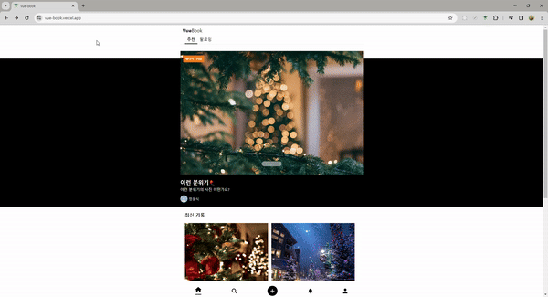

# VueBook



# Skills

- vue3
- uuid
- firebase
- vuex
- swiper
- vue-quill
- vue-advanced-cropper

# Notes

- 파이어베이스를 사용하기위해서는 파이어베이스 api key가 필요합니다.
- 카카오 로그인 api key도 등록해야합니다.
- root디렉토리에 .env 파일을 추가해야합니다.

```
VUE_APP_API_KEY= ....
VUE_APP_AUTH_DOMAIN= ....
VUE_APP_DATABASE_URL= ....
VUE_APP_PROJECT_ID= ....
VUE_APP_STORAGE_BUCKET= ....
VUE_APP_MESSAGING_SENDER_ID= ....
VUE_APP_APP_ID= ....
VUE_APP_API_URL = 본인 로컬호스트 (http://localhost:8080/)
VUE_APP_KAKAO_REST_API= ...
```
